{: .img-fluid}

The HCC Workshop is a collection of hands-on activities that demonstrate the research that the HCC Research group carries out at ANU. HCC uses the latest technology to explore computer-human interactions to make computers 'think ahead', and be responsive in their interactions with humans. We want computers to understand what users want when they perform specific tasks, and to enhance their user experience.

In the HCC Workshop, students will be able to play with some of the latest technology that we use in our research, such as having their eye gaze tracked. Students will have the opportunity to play games and have fun learning about leading research in an exciting blend of different fields such as computing, art, science, music, cyber security, psychology, social network analysis, digital humanities and biologically inspired computing.

## Problem Brief and Solution

The ANU College of Engineering and Computer Science (CECS) were seeking a refresh of engaging workshops and activities for outreach, engagement and marketing. The design brief asked for engaging challenges that promoted computer science and the world-leading research efforts of ANU to primary and high school students, particularly those with no previous technical backgrounds. ANU CECS sought to encourage potential students to study STEM (science, technology, engineering and mathematics), however a primary barrier was convincing time-poor academics to develop and run ad-hoc activities several times a year. ANU CECS wanted a long-term solution that reduced these barriers and provided a flexible and engaging outreach experience for students.

    

        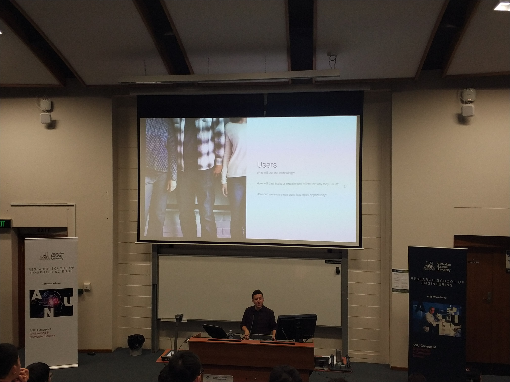
    

    

        
Our solution was to create an interactive web-based workshop that allows students to participate in engaging challenges whilst interacting with real researchers, and real research equipment. The workshop had a gamified element to further encourage student learning and interest, and was designed to be scalable to both workshop size and student level. The workshop application framework had the ability to toggle activities on and off, and contained built-in 'easter eggs' for extension students. Activities and challenges were focused toward the research of the <a href="https://cs.anu.edu.au/research/systems/human-centred-computing">Human Computer Interaction</a> research group within the Research School of Computer Science at ANU.

        
A re-usable and server-hosted workshop reduced a reliance on academic and administrative staff, thus allowing trained student ambassadors and PhD students to facilitate workshops with very little preparation or setup. An extensible core application framework served from Docker containers also allowed for future growth.

    

The workshop covered a range of broad computer science topics, but also allowed students to explore specialist research areas. This included the use of eye tracking, brain wave, heart rate and electrodermal activity monitoring, and the use of virtual reality and driving simulators. Many activities were instructor-led, whilst others allowed students to work at their own pace at a computer. Many activities encouraged teamwork and engagement with the workshop facilitators and staff. Users could level up through 17 levels for each activity that they completed, with a reward offered for those students who were able to reach the highest level. The design of the system allowed students to create a personalised login and dashboard so that they could keep track of their own progress, and so that they could log in later from home to revisit their work.

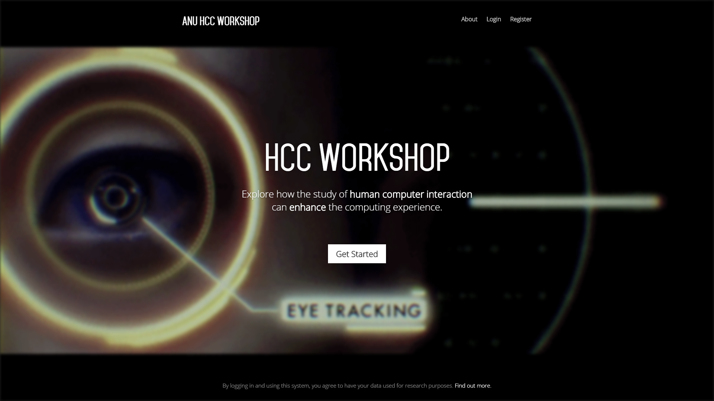{: width="49%"}
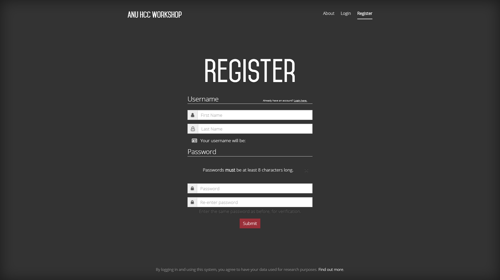{: width="49%"}

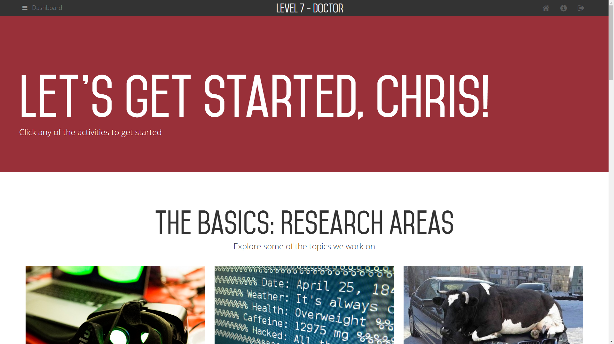{: width="49%"}
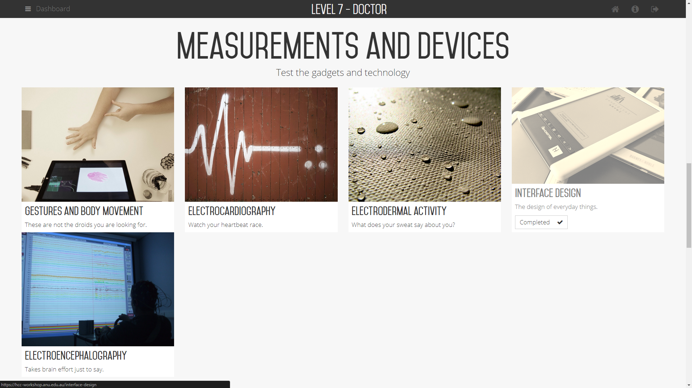{: width="49%"}

## Role and team

    

        
I initially served as the primary technical and application developer working alongside lead content creator <a href="http://leanacopeland.com">Leana Copeland</a>. Before Leana's departure in 2016, I managed provisioning of development and production environments, core workshop application framework development, and the realisation of content ideas into technical solutions.

        
I have since taken over as project lead to become the main point of contact for the HCC Workshop. I personally maintain all infrastructure and code, work with stakeholders to guide the strategy, content and direction of the workshop, and serve as the primary workshop facilitator whenever the HCC Workshop is held. I have mentored other students to contribute towards development or workshop facilitation.

        
Primary stakeholders that we communicated with included academic staff from ANU, the ANU CECS Marketing team, teachers, and organising committees from STEM outreach events.

    

    

    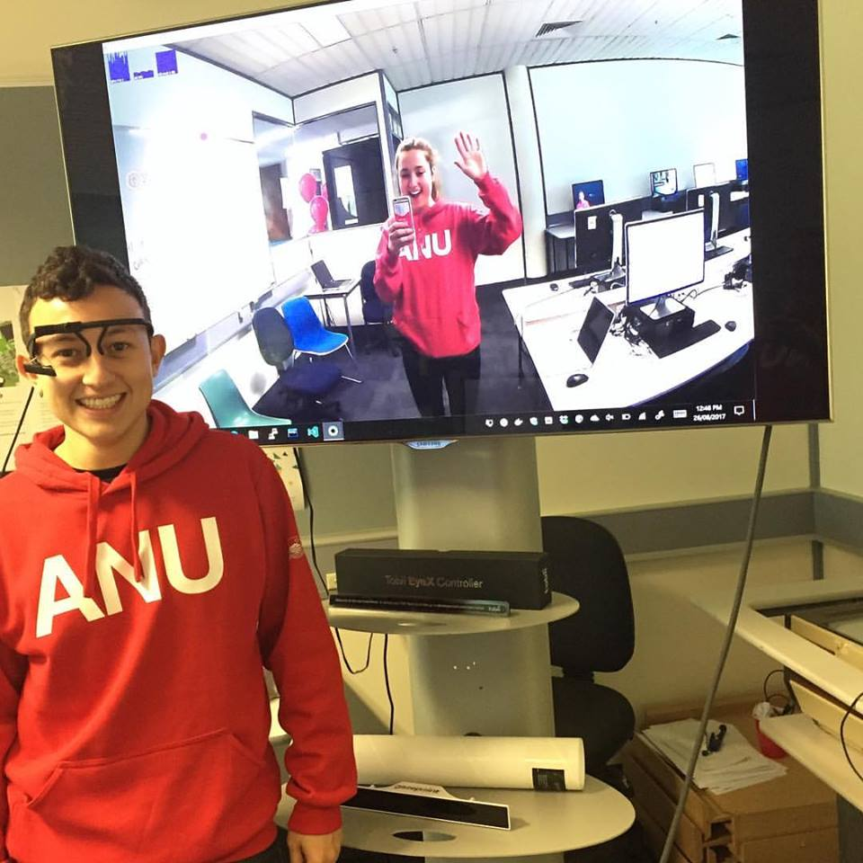
    

## Development Process

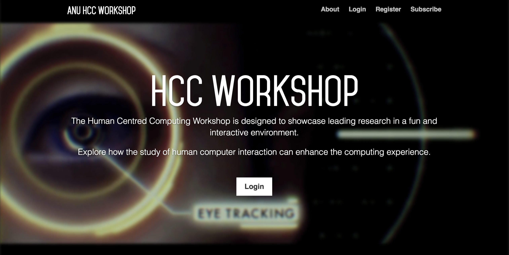{: width="33%"}
{: width="33%"}
{: width="33%"}

1. We met with and interviewed senior stakeholders in the project to brainstorm ideas. We spoke to academics from the ANU Human Computer Interaction research group to find out what activities they previously run, as well as their own ideas on how to effectively promote their research. We also engaged with the ANU CECS Marketing team directly to elicit finer details on intended audience, scope, and future intentions.
2. We developed a design proposal and commissioned an Honours student to develop a prototype using Flask. We worked with the developer to shape requirements, test the prototype and develop additional functionality. We presented the prototype to our stakeholders for further feedback.
3. We piloted the prototype in an ANU CECS outreach event for larger-scale user testing. We sought feedback from students and teachers involved so that we could iterate and improve the workshop.
4. We upgraded the prototype to Django. We designed and applied new styles, and expanded the workshop functionality and the range of challenges. The application was deployed to a production server.
5. We ran the workshop at a variety of ANU CECS outreach events. Feedback from every session was used to fine-tune the workshop and activities.

## Outcomes

{: width="33%"}
{: width="33%"}
{: width="33%"}

The HCC Workshop has been a popular activity for students visiting ANU's College of Engineering and Computer Science (CECS) for over three years. Over 300 students have participated in the workshop, with many participants later enrolling in STEM programs at ANU. The HCC Workshop has been well received by ANU academics and professional staff, as well as the large number of students, teachers, and volunteers that have participated. While the HCC Workshop was initially run on-campus at ANU, it's success meant that it quickly expanded to in-school programs across the ACT, Australia, and has even been held overseas.

The HCC Workshop has been run as part of:

* ANU [Open Day](http://www.anu.edu.au/study/events/open-day) 2015-2018
* ANU [Girls in Engineering and Technology Program (GET Set)](Girls in Engineering and Technology Program - GET Set) 2015-2017
* ANU [Girls in ICT Day](http://www.anu.edu.au/study/events/girls-in-ict-day) 2015-2017
* ANU [National Indigenous Science and Engineering Summer School](http://science.anu.edu.au/reconciliation/student-opportunities/national-indigenous-science-and-engineering-summer-school) 2016
* [IBM Exploring Interests in Technology and Engineering (EXITE)](https://cecs.anu.edu.au/events/ibm-exploring-interests-technology-and-engineering-exite-camp) camp 2016
* Various school visits 2016-2018
* [Northwestern Polytechnical University (NPU)](http://en.nwpu.edu.cn/) visit to ANU CECS 2017
* ANU CECS visit to [Shandong University at Weihai (SDUW)](https://en.wh.sdu.edu.cn/enDefault.html) in China 2017
* [National Youth Science Forum](https://www.nysf.edu.au/) 2017-2018
* ANU [CECS International Summer School](https://cecs.anu.edu.au/events/cecs-summer-school) 2018

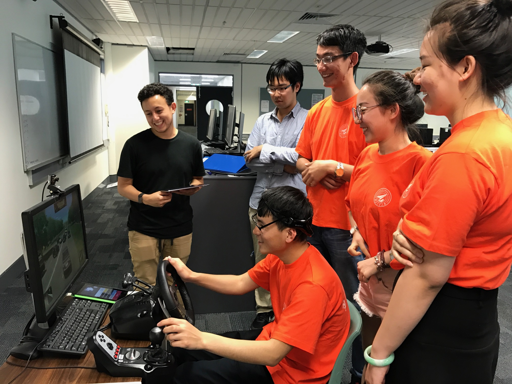{: width="33%"}
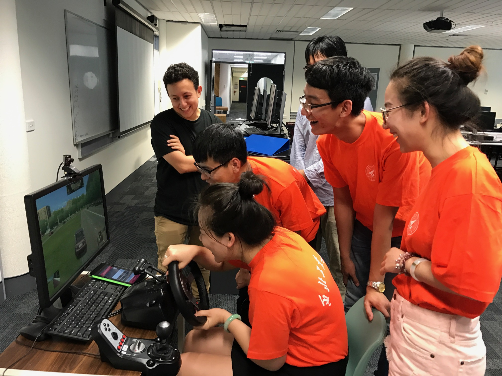{: width="33%"}
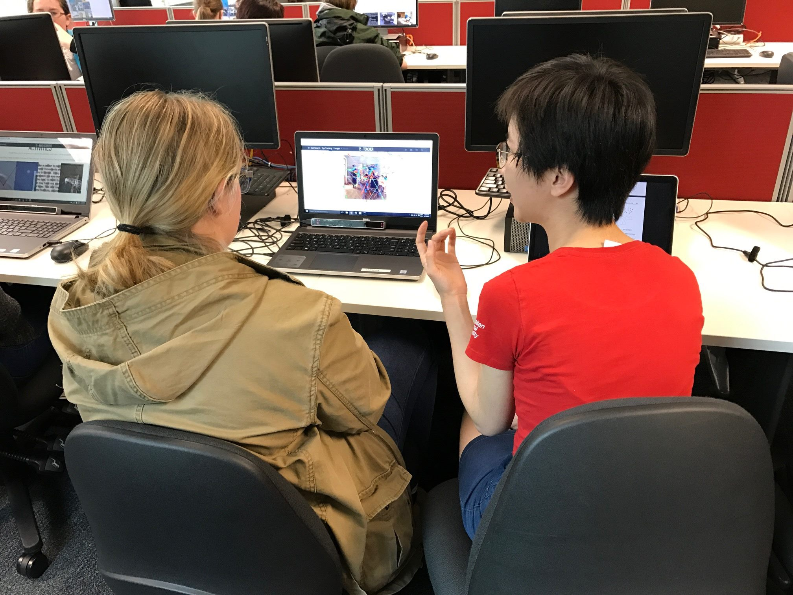{: width="33%"}

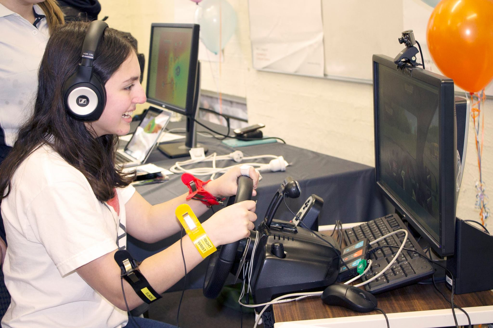{: width="49%"}
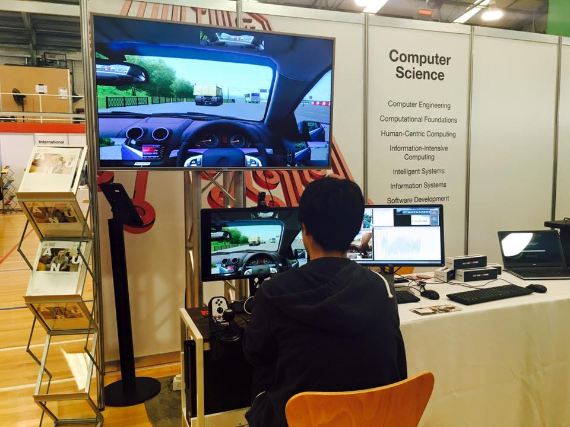{: width="49%"}

## Further Information

Visit the [HCC Workshop website](https://hcc-workshop.anu.edu.au).

[Make an enquiry](http://www.anu.edu.au/study/events/human-centred-computing-hcc) about the HCC Workshop with ANU.

Paper-based worksheets are also available to support certain activities on the HCC Workshop:

* [Interface Design Worksheet (PDF)](assets/pdf/interface-design.pdf)
* [Gestures Worksheet (PDF)](assets/pdf/gesture.pdf)
* [Eye Tracking Worksheet (PDF)](assets/pdf/eye-tracking.pdf)
* [Physiological Signals Worksheet (PDF)](assets/pdf/physiological-signals.pdf)
* [Information Design Worksheet (PDF)](assets/pdf/information-design-card-sort.pdf)
